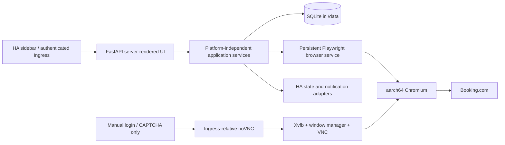
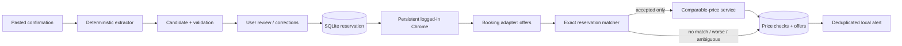

# BookingTracker architecture

## 0.4.0 import phase

`ReservationImportDocument` is the single boundary between untrusted text/PDF input and the
deterministic reservation extractor. The PDF adapter uses `pypdf` in memory only, limits input
to 10 MB/20 pages, rejects encrypted or active-content PDFs, and retains only normalized text
plus canonical HTTPS `/hotel/...` Booking URLs. Canonical URL is property identity evidence;
property-name aliases are review evidence and never weaken the exact matcher.

In 0.4.1, property identity is selected through deterministic evidence scoring: explicit Booking
headings and accommodation waiting sentences outrank sanitized PDF titles and aliases, while CTA
and navigation text are excluded. The review layer keeps recognized values read-only by default,
but validates every submitted correction with the same typed model.

BookingTracker is a local, single-user tool that tracks the price of an
existing Booking.com reservation. It is developed on macOS and deployed as a
Home Assistant add-on on a Raspberry Pi 4 (aarch64). Its governing invariant is
that price comparison is performed only after an available offer has been shown
to be equivalent to, or an explicitly-labelled upgrade over, the booked rate.

## Audit of the proof of concept

The current repository contains two experimental Playwright scripts:

| File | Decision | Reason |
| --- | --- | --- |
| `app/browser/browser_service.py` | Refactor | It proves persistent Chrome-profile launch, reuse of a logged-in page, and direct Booking URL navigation. Its REPL, globals, console output, arbitrary waits, and room-row/price assumptions are disposable. |
| `app/browser/login_test.py` | Retire after Phase 2 | It is a useful manual smoke-test reference, but duplicates browser lifecycle logic and parses a room row as one offer. |

No application domain, persistence, test, package, lint, or UI structure exists yet. The `data/booking_profile` directory is user authentication state and must never be inspected for values, logged, or committed.

## Design principles

- Local-first: SQLite and a local FastAPI application; no cloud service,
  Supabase, email ingestion, credential storage, or automatic actions.
- Deterministic first: dates, money, occupancy, cancellation deadlines,
  navigation, matching, and arithmetic are code, not LLM decisions.
- Evidence first: every scrape stores the source URL, row text, parser
  warnings, and a rate snapshot needed to explain a decision.
- Safety first: a lower price is irrelevant until exact-match constraints
  pass. Ambiguous upgrades are presented, not silently treated as matches.
- One browser context: Chrome launches once with `data/booking_profile` and
  stays alive for manual login and serialized checks.
- Platform boundary: matching, parsing, scheduling policy, and persistence
  contracts have no Home Assistant, Docker, VNC, or filesystem assumptions.
- Ingress safety: generated links, redirects, static assets, forms, API calls,
  and remote-browser routes are relative to the mounted base path, never `/`.

## Home Assistant production architecture

Production runs one add-on container with a FastAPI server-rendered UI,
SQLite, one scheduler, and one managed Chromium context. Runtime state is
outside the image in `/data/bookingtracker.db`, `/data/booking_profile/`, and
`/data/logs/`. `AppPaths` is the single path/configuration abstraction: local
development uses checkout-relative `data/` and `logs/`; the add-on sets its
data root to `/data`.



The add-on manifest will declare `aarch64`, `startup: application`, `boot:
auto`, `ingress: true`, an explicit ingress port, and a localhost
health/watchdog endpoint. It follows the public Home Assistant add-on
conventions exemplified by [EVCC's manifest](https://github.com/evcc-io/hassio-addon).
No profile, database, log, token, or secret is copied into an image layer.

The remote browser is a manual-recovery facility, not the normal UI. On Home
Assistant, the one persistent Chromium runs headful in Xvfb with Openbox so its
same context can be viewed without relaunching it. x11vnc and websockify start
only for a manual lease, bind only to loopback, and are bridged through FastAPI
and authenticated Home Assistant Ingress. There is no public VNC/noVNC port,
password capture, profile export, credential automation, or CAPTCHA bypass.

Browser states are `STARTING`, `READY`, `LOGGED_OUT`, `LOGIN_REQUIRED`,
`CAPTCHA_REQUIRED`, `ERROR`, and `STOPPED`. A crash has bounded recovery;
repeated failures become `ERROR`, not an infinite loop. Checks remain
serialized through one browser/context to protect Pi memory.

## Proposed project tree

```text
BookingTracker/
├── app/
│   ├── api/                 # FastAPI routes and server-rendered pages
│   ├── booking/             # Booking adapter, selectors, parser, models
│   ├── browser/             # persistent Chrome service and navigation
│   ├── db/                  # SQLite connection, migrations, repositories
│   ├── matching/            # hard constraints, scoring, explanations
│   ├── notifications/       # local notifier abstraction
│   ├── pricing/             # comparable-total and price-check service
│   ├── reservations/        # typed models, import, validation
│   ├── scheduler/           # serialized conservative check loop
│   ├── ui/                  # templates and static assets
│   ├── integrations/
│   │   └── home_assistant/  # HA state/notification adapter boundary
│   └── config.py            # AppPaths and platform-neutral configuration
├── ha-addon/                # Phase 8+ packaging only
│   ├── config.yaml
│   ├── Dockerfile
│   ├── run.sh
│   ├── DOCS.md
│   ├── CHANGELOG.md
│   └── rootfs/
├── data/
│   └── booking_profile/     # ignored persistent Chrome profile
├── logs/                    # ignored runtime logs
├── scripts/                 # login, import-text, and manual check entrypoints
├── tests/
│   ├── fixtures/            # sanitized confirmations and Booking DOM
│   ├── integration/
│   ├── smoke/               # opt-in only; never normal CI
│   └── unit/
├── AGENTS.md
├── ARCHITECTURE.md
├── IMPLEMENTATION_PLAN.md
├── README.md
├── pyproject.toml
├── .env.example
└── repository.yaml
```

## Core domain

Schema migration 5 extends the append-only `price_checks` history in place with
structured diagnostics (`started_at`, `finished_at`, `duration_ms`, stable
`reason_code`, sanitized detail, failure count, and next attempt). Keeping the
diagnostics on the existing immutable attempt row preserves its foreign-key link
to the reservation, rate snapshots, and alerts. The runner finalizes those fields
and the corresponding `schedule_states` backoff in one SQLite transaction. Rows
created before migration 5 remain readable; a missing `started_at` falls back to
the historical `checked_at`, and new nullable fields remain unknown.

`Reservation` is the reviewed, persisted fact of what was booked. It retains
separate `booked_total_price`, `booked_payable_price`, `booked_base_price`,
and `taxes_and_fees`; it never collapses these values into a single guessed
total. It also captures property, dates, nights, adults/children/ages,
rooms, room type/breakdown, meal and breakfast facts, cancellation and
payment conditions, currency, source text, confidence, and active state.

`ReservationCandidate` is an unpersisted extraction result. It includes
field-level confidence, missing critical fields, ambiguous-price warnings,
and validation errors. It can only be activated after a review confirms the
critical fields.

`RateOffer` represents one distinct rate, not a room row. It preserves room,
occupancy, meal/breakfast/Genius facts, current and original prices,
cancellation/payment/tax facts, source text and URL, timestamp, DOM evidence,
and parser warnings.

### Phase 3 rate-offer parser

`BookingRateParser` consumes an already navigated page supplied by
`BookingBrowserService`; it never launches a browser or owns a profile. It
maps one `data-testid=rate-option` container to one typed `RateOffer` under its
parent `data-testid=room-row`. A candidate without a scoped, parseable
`current-price` is recorded as `PARTIAL` with a warning and is never converted
into a made-up price.

Selectors are centralized in `app/booking/selectors.py`. The current adapter
prefers narrow data-testid relationships and puts localized money, breakfast,
cancellation, and tax classification in `app/booking/normalization.py`. It
distinguishes parser outcomes: `SUCCESS`, `NO_AVAILABILITY`,
`UNSUPPORTED_STRUCTURE`, `PARTIAL`, and `ERROR`; an unsupported page can never
masquerade as no availability.

The adapter also supports Booking's current legacy availability-table shape:
each `tr.js-rt-block-row` is a scoped rate container, with its own room-link,
price, occupancy, cancellation, and payment descendants. This fallback is
deliberately narrow and returns `UNSUPPORTED_STRUCTURE` or `PARTIAL` rather
than treating an unknown DOM as no availability.

Rate evidence retains only source rate text and selector names. Developers may
use `scripts/capture_rate_fixture.py` to extract and sanitize the narrow
availability subtree, but must inspect the result for personal data before any
fixture is committed. It removes scripts and likely session/account-bearing
attributes as a defense in depth; it never captures cookies or the profile.

`MatchResult` contains `accepted`, score, classification (`equivalent` or
`upgrade_candidate`), matched rate, reasons, warnings, and rejected
candidates. `PriceCheck` is an append-only result with explicit status,
comparable amount, booked amount, delta, rate snapshot, and error.

## Data flow



## Reservation import

The deterministic parser uses section-aware, locale-tolerant patterns for
dates, currency/amounts, guest and room counts, room text, cancellation text,
and labelled totals. It returns `null` for unknown facts and flags competing
totals rather than guessing. A replaceable LLM extraction provider may be
called only for fields still ambiguous after deterministic parsing. Its typed
output is merged only through the same validation path and is never persisted
directly.

## Browser lifecycle and Booking adapter

`BookingBrowserService` owns the Playwright runtime, persistent context, and
internal pages. It launches Chrome with the configured profile once, exposes
login state, reuses a page or opens a replacement if closed, and serializes
checks. It never enters credentials or attempts CAPTCHA/anti-bot bypass.

The navigation layer produces direct URLs using the canonical hotel URL plus
check-in/out, adults, children and ages, and rooms. Once a canonical URL is
resolved it is stored on the reservation. Navigation detects logged-out and
challenge pages and returns `LOGGED_OUT` or `CAPTCHA`, rather than a price.

Selectors live in one Booking-specific module. The parser first scopes each
room, then identifies its distinct rate containers, extracting each offer
without selecting the first price in a table row. Stored sanitized fixtures
are the primary regression contract; live Booking checks remain manual smoke
tests.

### Phase 2 browser-service boundary

`BookingBrowserService` is the only interface later services use for Playwright
lifecycle. It owns one persistent context, one primary page, and a re-entrant
process-local lock that serializes `start`, page recovery, navigation, and
shutdown. The high-level contract is `start()`, `stop()`, `ensure_page()`,
`navigate(url)`, `current_page()`, `is_logged_in()`,
`requires_manual_action()`, `status()`, and `health()`.

The service exposes `STOPPED`, `STARTING`, `READY`, `LOGGED_OUT`,
`LOGIN_REQUIRED`, `CAPTCHA_REQUIRED`, and `ERROR` states. It reports Booking
authentication separately as `authenticated`, `logged_out`, or `unknown`;
unknown is preferred to a false authentication claim. Account controls,
sign-in controls, URL hints, and visible challenge text are combined without
reading cookies or tokens.

`NavigationResult` translates Playwright behavior to `SUCCESS`, `TIMEOUT`,
`NAVIGATION_ERROR`, `BROWSER_CRASH`, `PAGE_CLOSED`, `LOGIN_REQUIRED`, or
`CAPTCHA_REQUIRED`. `BrowserHealth` reports process/context/page availability,
authentication/manual-action state, the last successful navigation, and a
sanitized last error. If the primary page closes, the service deterministically
reuses a surviving context page or creates a replacement; it never selects an
unrelated popup by accident.

Development uses the configured Chrome channel and the existing ignored
profile at `data/booking_profile`. Future HA deployment replaces only the
browser settings and `/data` path; the application interface remains the same.
The profile has an exclusive Chrome lock, so a second browser process must not
be launched against it while the managed context is already active.

## Exact matcher

Hard constraints reject a candidate with the wrong dates, rooms, insufficient
occupancy, clearly different room, missing required breakfast, a
non-refundable substitution for a flexible reservation, or materially worse
cancellation/payment terms. Known meal and cancellation facts participate in
matching; unknown facts do not get invented.

Candidates surviving hard constraints receive an explainable score based on
normalized room wording, known meal/occupancy/cancellation alignment, and
evidence completeness. Room-name normalization may accept punctuation,
singular/plural, and harmless wording differences, but does not equate
materially different variants such as a balcony room. A better room is an
`upgrade_candidate`, never silently equivalent.

Only an accepted result is sent to the price service. That service compares
like-for-like totals in the same currency and records a delta. A failed
navigation, parsing error, logged-out state, CAPTCHA, or no match is stored
as its own status, never as a price.

### Phase 4 exact matcher

`ExactReservationMatcher` is a pure domain service: it accepts a reviewed
`Reservation` and `RateOffer` values and produces typed `MatchResult` and
`CandidateEvaluation` objects. It has no Playwright, database, scheduler, UI,
or Home Assistant dependency, and does not read price for scoring or selection.

Known property mismatches, insufficient occupancy, room-type conflicts,
missing booked breakfast, meal-plan mismatch, non-refundable substitution for
a flexible booking, and earlier known cancellation deadlines are hard rejects.
Unknown candidate occupancy, breakfast, meal, or cancellation facts produce
`AMBIGUOUS` with warnings instead of being treated as false or accepted exactly.

After hard rules, an interpretable weighted score combines room (45%),
occupancy (20%), meal (15%), cancellation (15%), and payment (5%). Room names
use conservative token/feature normalization; known room upgrades are returned
as `UPGRADE_CANDIDATE` and excluded from automatic selection. The selection
order is `EXACT`, `EQUIVALENT`, then `BETTER`; every candidate is preserved in
the result. A later price service may only use an accepted result.

## Phase 5 persistence and explicit checks

`SQLiteDatabase` applies ordered, transactional migrations recorded in
`schema_migrations`. Migration 1 creates `reservations`, append-only
`price_checks`, and immutable `rate_offer_snapshots`; foreign keys are enabled
on every connection. Reservation source text remains private local data. Money
is stored as decimal text, never SQLite floating point, and timestamps are UTC
ISO-8601 values.

Each explicit check stores its terminal status and all parsed offers in the
same transaction. Statuses are `SUCCESS`, `NO_MATCH`, `AMBIGUOUS`,
`NO_AVAILABILITY`, `LOGGED_OUT`, `CAPTCHA_REQUIRED`, `NAVIGATION_ERROR`,
`PARSER_ERROR`, `BROWSER_ERROR`, and `TIMEOUT`. History rows and snapshots are
never updated, so a failed later check cannot overwrite an earlier result.

`PriceCheckService` joins the existing browser, parser, matcher, pricing, and
repository layers for one user-invoked check. It does not schedule checks,
send alerts, or modify bookings.

The comparable-price policy is deliberately narrow: only an accepted matcher
result, a matching currency, a known booked total, and a current offer that
explicitly includes mandatory taxes/fees are comparable. The basis is
`final_total_including_taxes`; no conversion or inferred tax value is used.
`delta_amount = current_price - booked_total`, so a negative delta is cheaper.

## Phase 6 scheduling and alerts

`ReservationScheduler` is a lightweight, pollable single-process scheduler.
It loads active reservations and persisted `schedule_states`, then delegates
each due item to `CheckRunner`. The runner owns one lock, so manual and
scheduled operations use the same browser/check pipeline and cannot navigate
the persistent browser context concurrently. `stop()` prevents further polls;
state is in SQLite rather than in-memory timers, so restart recovery is simply
the next `run_due()` call.

The default interval is eight hours (three checks per day). Disabled
reservations and reservations on/after check-in are skipped. Normal terminal
states reset the failure count. Navigation, timeout, browser, and parser
failures back off exponentially up to 24 hours. Login and CAPTCHA conditions
wait seven days, avoiding repeated requests until the user manually recovers
the session. Jitter is injectable and bounded to ten minutes (or 10% of the
delay) for deterministic tests.

Migration 2 adds `schedule_states` and `alerts`. Alerts have a stable dedupe
key, acknowledgement state, and separately mutable delivery status. A
`PRICE_DROP` requires a successful, comparable check with a negative delta;
its key includes reservation, current comparable price, and match
classification. A new lower observed price may separately create
`NEW_HISTORICAL_LOW`; this is distinct from being below the booked price.
`LOGIN_REQUIRED`, `CAPTCHA_REQUIRED`, and thresholded `CHECK_FAILED` alerts
use stable state keys to suppress repeats. `ConsoleNotificationAdapter` is the
local notification boundary; a delivery failure is recorded on the alert and
never rolls back the underlying check.

## Phase 7 local web interface

The local FastAPI/Jinja interface is server-rendered with local CSS and no
frontend build step. `create_app(base_path=...)` prefixes every generated
route, form action, redirect, and static asset path; tests exercise the UI at
`/bookingtracker-test/`. It uses a per-process CSRF token for state-changing
forms, POST-only mutations, escaped template values, and never renders browser
profile paths, cookies, tokens, or dashboard source confirmation text.

The application lifespan migrates SQLite and owns one poll task; it invokes the
existing persistent scheduler and stops it cleanly on shutdown. It constructs,
but does not automatically launch, the headed browser service. Dashboard,
extraction/review, detail/history, alerts, and browser-status screens remain
thin adapters over existing repositories and `CheckRunner`; no browser,
matching, or price logic is duplicated in routes.

For production, `HomeAssistantNotificationAdapter` is added alongside the
local adapter. It sends deduplicated Home Assistant notifications and exposes
safe state such as browser status, active reservation count, last successful
or failed check, best saving, and manual-action required. Core code remains
usable without Home Assistant.

## Phase 11 planned presentation architecture

Phase 11 keeps the existing server-rendered, local, single-user architecture.
It may use TripWatch's information density as visual inspiration, but must not
copy its brand or source code. No cloud frontend, external analytics, or direct
frontend access to the browser, database, or Booking DOM is introduced.

Phase 11A / 0.5.0 is production-complete. The 0.5.1 diagnostic intermediate release adds no
second pipeline or browser. Its CSRF-protected POST action calls `CheckRunner.try_run_check`,
which attempts the same process-wide lock used by scheduled checks without waiting. The lock
serializes all navigation through the one persistent browser context. The existing manual lease
is checked both before and after lock acquisition, so remote user control and automation cannot
overlap. Busy, leased, missing, and inactive outcomes are typed and do not create history rows.

Every completed scheduled or manual attempt follows the same policy, atomic check/schedule
persistence, exact matcher, alert service, and deduplication. It emits one sanitized stdout JSON
event named `booking_check_completed`. No diagnostic HTTP endpoint exposes SQLite or raw page
data. Production validation for 0.5.1 is pending on STORHAUGEN GARD using the exact command and
procedure documented in `README.md`. Reservation overview, images, and expanded detail/history
are deferred respectively to 0.5.2, 0.5.3, and 0.5.4.

The presentation layer maps domain enums and internal statuses to Czech user
text. Domain enums remain stable and are not renamed for UI purposes. Every
known value has an explicit presentation mapping; an unknown value renders as
`Neznámý stav`, while the original value remains available only to sanitized
diagnostics or logs. Main pages must not expose raw values such as `ready`,
`running`, `timeout`, `parser_error`, or `Not safely comparable`.

One central route/helper layer remains responsible for every navigation URL,
form action, redirect, and static asset URL. It derives the request-specific
Home Assistant Ingress/base-path prefix exactly once. Navigation, active-page
state, back links, post-save redirects, image routes, and card/detail links
must use this layer rather than root-relative paths.

A reservation-list view-model prepares all card data: localized dates and
relative times, Czech status labels, display prices, comparability, delta
amount, percentage, and direction. Jinja templates only render that result;
they must not calculate price differences or decide whether an offer is
comparable. A price and green/red direction are available only after the
existing matcher has accepted an exact, equivalent, or explicitly labelled
better offer and the pricing service has accepted its comparison basis.
Waiting, failure, and non-comparable results remain neutral grey states with no
false price arrow.

Property image persistence is a separate adapter rooted below `/data`. It
validates MIME type and actual content, dimensions, maximum size, and safe
names; produces an optimized local thumbnail; and returns only a safe relative
reference for database storage. Images are never stored in the image layer,
logs, fixtures, cookies, tokens, or signed URLs. Missing and failed images use
one local placeholder. Reservation deletion must define explicit image cleanup
semantics. A future Booking-derived thumbnail may use only the concrete
reservation page in the existing authorized browser session, be locally
cached without hotlinking, and remain independent from price checking.

Shared CSS design tokens provide compact, accessible typography and spacing:
body text 14–15 px, desktop H1 at most 28 px, card titles 17–18 px, and metadata
12–13 px. Responsive cards use a local CSS grid and preserve focus states,
keyboard operation, mobile layout, and horizontal-overflow safety. No frontend
build step is required unless a separately approved local chart solution
demonstrably needs one; the planned price-history graph uses no external CDN.

Phase 10 notification design: the global minimum price drop is 5%, with an
optional Decimal per-reservation override (greater than 0 and no more than
100). Only an accepted exact/equivalent or explicitly-better match with a
comparable final total, same currency, and known critical facts can create a
price-drop alert. The persisted dedupe state records threshold bands: with 5%,
the first 5%, 10%, 15%, and later bands notify once; returning to an already
notified band never does. A threshold change silently rebases state to the
historical high-water mark under the new threshold, preventing a configuration
change from replaying old drops.

The generic HA notify adapter uses the supported Core API proxy at
`http://supervisor/core/api/`, enabled only by `homeassistant_api: true`, and
uses the transient `SUPERVISOR_TOKEN` bearer token only for that request. It
calls `notify.send_message` targeting a user-configured `notify.*` entity.
Home Assistant—not BookingTracker—owns any Telegram token or chat ID. Failed
delivery leaves the immutable price check and generated internal alert intact;
the attempt, sanitized error, and delivery state are persisted for a safe retry
without regenerating or duplicating the alert.

Phase 10 production verification completed on Raspberry Pi 4 / Home Assistant
OS with the configured `notify.roman` entity. The BookingTracker diagnostic was
delivered by Home Assistant's Telegram Broadcast integration; token and chat
configuration remained entirely within Home Assistant.

## Raspberry Pi resource and deployment risks

The Pi runtime intentionally has one FastAPI process, one scheduler, one
Chromium context, SQLite, and bounded rotating logs. Chromium is the dominant
memory consumer; a 4 GB Pi is the practical minimum and 8 GB is preferred when
using manual noVNC. Normal idle operation should have low CPU.

The primary technical risk is native aarch64 Chromium/Playwright availability
and system dependencies inside the selected add-on base image. Phase 8
production verification proved a native arm64 image can start, migrate `/data`,
pass its health endpoint, cleanly stop, and start the browser. Phase 9
production verification proved the Ingress/WebSocket/noVNC path under a
non-root base path, persistent manual Booking login, and persistent-context
browser smoke on the real Pi. These checks never require a real Booking login
in CI.

## Prebuilt add-on distribution

The production image has one Dockerfile: `bookingtracker/Dockerfile`. A
tag-gated GitHub Actions release verifies pytest, Ruff, production imports,
packaging, and version consistency before building it for `linux/arm64` and
pushing `ghcr.io/krsnak/bookingtracker-addon:<version>`. The Docker labels use
the same release version and `aarch64` build arguments. `config.yaml` names the
generic GHCR image and its matching `version`, so Supervisor pulls the precise
release instead of running a local build.

The repository's first GHCR package publication must be made public in GitHub
Packages; Home Assistant then pulls it anonymously with no registry credentials
in the add-on. The workflow has only `contents: read` and `packages: write` and
uses `GITHUB_TOKEN`; it never receives user data, browser state, Telegram
credentials, or `SUPERVISOR_TOKEN`. A failed release never updates the add-on
manifest version. For ordinary upgrades use Home Assistant's Update button;
`ha store repair` and Supervisor restart remain emergency diagnostics. Rollback
means selecting the repository revision whose manifest points to the preceding
known-good immutable image version.

The first end-to-end validation completed with `0.3.3` on Raspberry Pi 4 /
Home Assistant OS: the 9m 13s `v0.3.3` workflow published the public ARM64
image, Supervisor pulled it with no local `buildx` build, and the add-on
started directly from GHCR. Ingress, noVNC, browser profile persistence,
authenticated session recovery, ARM64 browser smoke, and clean restart all
worked.

## Reference review

TripWatch's public implementation usefully demonstrates a shared price-check
pipeline, append-only price history, explicit guest/multi-room input,
cancellation-aware matching, check-now actions, and scheduled runs. This
project adopts those concepts, not its implementation: TripWatch's Supabase,
NAS service, Vercel cron, public SaaS concerns, and inbound-email flow are out
of scope. BookingTracker instead uses the user's own persistent logged-in
Chrome context and local SQLite.

Public HA Chromium/noVNC references demonstrate the Xvfb + window manager +
VNC + websockify topology. BookingTracker adopts only that operational pattern
and keeps it behind authenticated Ingress; it does not expose a standalone
remote desktop service.
